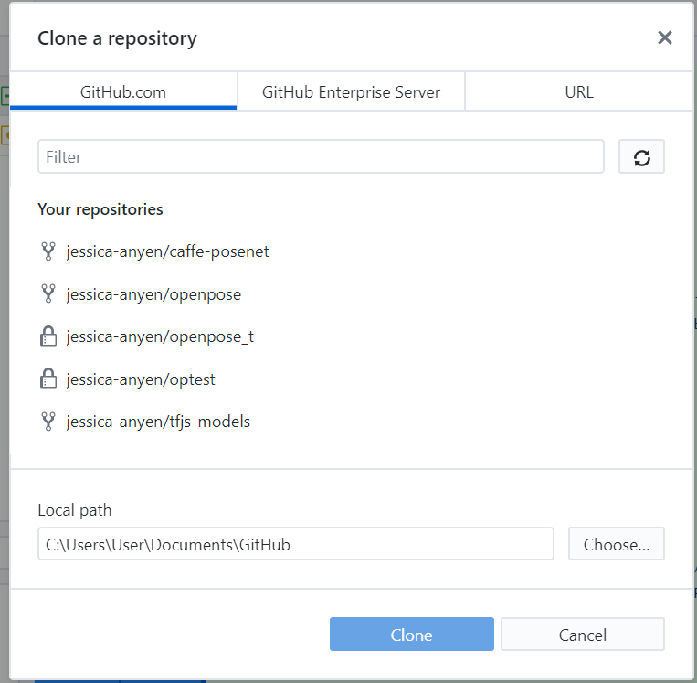

# openpose 手冊


0827更新:重新build了一次，相關路徑請改成build1

這次依照教學文件的用法，就可以執行了\(冏


這次安裝openpose是從零開始，紀錄一下安裝的過程跟會遇到的問題。

## 0.環境

-**作業系統:** windows10

-**顯示卡**:NVIDIA GeForce RTX 2070

-**CUDA**:最新版，用ToolKit工具安裝

-**Visual Studio**: 2019 professional版 \(用commity版失敗...，重點在_c++相關套件一定要裝_，沒有裝到的話可以installer再裝上去\)

### 1.下載github Desktop

[https://desktop.github.com/](https://desktop.github.com/)

### 2.fork/clone  openpose專案

先登入自己的github帳號--&gt; fork --&gt; 選擇clone or download  --&gt;複製網址

開啟github Desktop--&gt;file --&gt;clone repository



直接點選 "your repository" 中的openpose，按下clone


完成後就會在指定路徑下找到專案。

### 3.CMake

cmake 網站: [https://cmake.org/download/](https://cmake.org/download/)

Windows 的話請下載 `cmake-X.X.X-win64-x64.msi`。

### 4. 安裝visual studio

我是安裝vs 2019 professional 試用版，用community版會失敗...

重點在安裝的時候，c++相關的元件都要裝\(沒裝到可以用installer--&gt;modify\)


### 5.安裝cuda

我裝的是cuda10，也就是最新版的。如果要確定可以點nvidia控制面板--&gt;點選幫助--&gt;看產品支持哪一個版本。\(圖是網路找的\)


這一步要在安裝完 Visual Studio 之後做，因為安裝過程會產生一些 Visual Studio 需要的檔案



### 6.安裝 cuDNN

我一樣裝的是最新版，以前的教學都說不用註冊。但是現在要註冊nvidia會員才能下載。

cuDNN 壓縮檔裡面會有三個資料夾，可以對應到 C:\Program Files\NVIDIA GPU Computing Toolkit\CUDA\vX.0 裡面也有的資料夾，分別把檔案放到對應的資料夾就好

### 7.設定檔案路徑（在 clone 下來的路徑中自己創一個 build 資料夾，並設定成 Where to build the binaries）

source code 就是github code 載下來那包的位置

build就是在那包code的位址下面建一個資料夾\(我是命名成build


按下 Configure 按鈕（generator 記得選 Visual Studio 16 2019 Win64）\(圖片示意\)，按下finish

這一步會比較久，但如果使用nvidia顯卡就沒有太大問題


等待Configure Done


勾選bulid python\(這步一定要做\)，按下generate


到build/OpenPose.sln路徑下，對專案右鍵--&gt;開啟檔案--&gt;選擇vs


切換到 **Release Mode** 並 Build Project  \(一定要用release mode!!\)

如果上面的步驟都做完，應該可以在 openpose\build\python\openpose\Release 看到 openpose\_python.cp36-win\_amd64.pyd library 文件。（OpenPose 原生是用 C++ 寫的，是用 pybind11 包成 Python 可以呼叫的 library）。

名字每一個版本可能會不太一樣，像我的lib就跟教學文章不一樣\(如圖\)


然後，如果電腦沒有鏡頭，一定會報錯。把執行視窗關掉就好，我們用其他方法。

### 8.如何跑圖片

到了lib跑出來之後，就可以來跑圖片/影片了

詳細執行教學可以看官方文件: [https://github.com/CMU-Perceptual-Computing-Lab/openpose/blob/master/doc/quick\_start.md\#running-on-video](https://github.com/CMU-Perceptual-Computing-Lab/openpose/blob/master/doc/quick_start.md#running-on-video)

**圖片運行的方法:**

官方使用方法:

```text
:: Windows - Portable Demo
bin\OpenPoseDemo.exe --image_dir examples\media\
:: With face and hands
bin\OpenPoseDemo.exe --image_dir examples\media\ --face --hand

:: Windows - Library - Assuming you copied the DLLs following doc/installation.md#windows
build\x64\Release\OpenPoseDemo.exe --image_dir examples\media\
:: With face and hands
build\x64\Release\OpenPoseDemo.exe --image_dir examples\media\ --face --hand
```

自己試出來的方法:

1.先對其中一個範例右鍵--&gt;設為"啟始專案"


2.將要使用的圖片放在路徑:


3.回到vs，點開被設為啟始專案的目錄--&gt;source files--&gt;點開.cpp檔


找到image path，將所使用的檔名+副檔名改上去


release mode 下建置


結果


### 9.如何跑影片

官方使用方法

打開PowerShell \(Windows button + X, and then A\)，然後cd 到openpose路徑下\(或者在資料夾中直接開啟\)

```text
cd C:\Users\MMN-AI\Documents\GitHub\openpose
```

輸入以下指令\(video.avi可換成所需影片\) 

```text
build\x64\Release\OpenPoseDemo.exe --video examples\media\video.avi
```

官方使用方法原文

```text
:: Windows - Portable Demo
bin\OpenPoseDemo.exe --video examples\media\video.avi
:: With face and hands
bin\OpenPoseDemo.exe --video examples\media\video.avi --face --hand

:: Windows - Library - Assuming you copied the DLLs following doc/installation.md#windows
build\x64\Release\OpenPoseDemo.exe --video examples\media\video.avi
:: With face and hands
build\x64\Release\OpenPoseDemo.exe --video examples\media\video.avi --face --hand
```

結果


基本的就完成拉~


